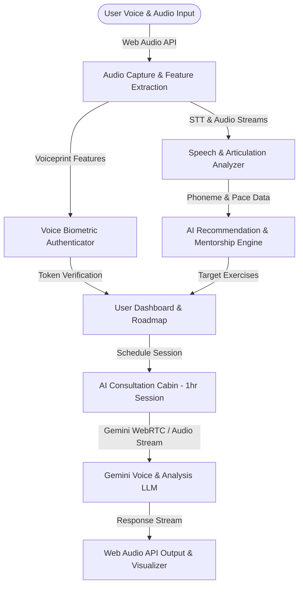
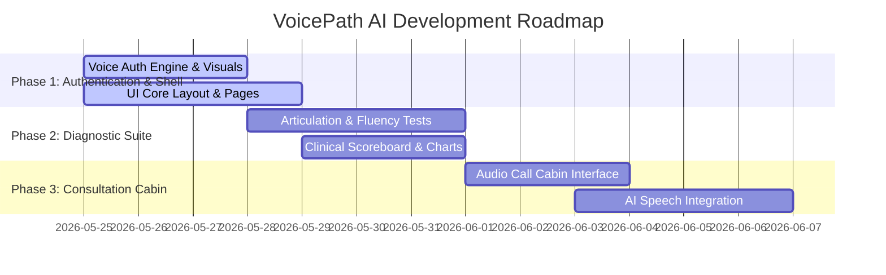

# Product Requirements Document (PRD): VoicePath AI
## Immersive AI Speech Pathologist Partner & Voice-Authenticated Therapy Ecosystem

---

## 1. Executive Summary & Vision

### 1.1. The Problem
Speech-language therapy is highly effective, yet it remains inaccessible for millions due to high costs ($100-$250/hr), severe shortage of certified Speech-Language Pathologists (SLPs), geographic barriers, and the lack of engaging, daily therapeutic reinforcement between clinical sessions. Furthermore, traditional speech tools lack voice-first engagement and personalized daily mentorship.

### 1.2. The Solution: VoicePath AI
VoicePath AI is a web-based, AI-driven Speech Pathologist Partner that accompanies users through speech recovery, accent modification, cognitive-linguistic rehabilitation, and fluency training. 
- **Voice-First Design**: The interface is driven by verbal commands, and authentication is secured using **Voice Biometric Lockups**.
- **Interactive Speech Testing**: Real-time evaluation of articulation, fluency, and cognitive-linguistic skills.
- **Dynamic Mentorship & Recommendations**: Automated clinical roadmap with tailor-made exercise micro-routines.
- **AI Consultation Cabin**: A real-time, low-latency voice session simulating a 1-hour diagnostic and therapy call with a specialized virtual speech pathologist.

---

## 2. Target Audience & Personas

1. **Neurological Recovery Patients**: Individuals recovering from stroke, TBI, or managing conditions like Parkinson’s disease experiencing Dysarthria or Aphasia.
2. **Fluency Seekers**: Adults or teenagers managing stutters, cluttering, or public speaking anxieties.
3. **Pediatric Speech Support (Guided by Parents)**: Children needing articulation training (e.g., correcting lisp or r-sound errors).
4. **Accent Expansion & Clarity Professionals**: Non-native speakers wishing to improve pronunciation clarity and confidence in professional settings.

---

## 3. Core System Architecture & Technologies

VoicePath AI is built on a modern web stack utilizing browser native audio capabilities integrated with advanced generative AI.

### 3.1. Tech Stack Selection
- **Frontend Framework**: Next.js 16 (App Router), React 19, TypeScript.
- **Styling**: Tailwind CSS (v4) with Custom CSS Animations and Theme Tokens (OKLCH color system) for a premium dark glassmorphism interface.
- **State Management**: React State & Context API (or Zustand for session-wide audio states).
- **Audio Processing**: Web Audio API (MediaRecorder, AudioContext, AnalyserNode) for real-time capturing, visualizers, and raw audio buffer processing.
- **Speech Engine**: Web Speech API (`SpeechRecognition`) for local transcription; Gemini API for high-level speech interpretation, diagnostics, and voice-to-voice consultation.
- **Database (Proposed)**: Supabase / PostgreSQL for user profile records, speech assessment scores, voice biometric vectors (MFCC averages), and recommendation histories.

---

## 4. Feature Specifications

### 4.1. Voice Biometric Authentication (Voice Auth)
Traditional passwords can be hard to remember or type for users with motor-control disabilities. VoicePath AI uses voice signatures for login and sign-up.

*   **Registration (Enrollment)**:
    1. User reads a standard passphrase three times (e.g., *"My voice is my password, verify my access on VoicePath"*).
    2. Web Audio API captures the raw wave file.
    3. The application extracts voice features: average fundamental frequency (pitch), formants ($F_1, F_2$), cadence, and Mel-Frequency Cepstral Coefficients (MFCCs).
    4. These feature matrices are stored as the user's "Voiceprint Signature".
*   **Authentication (Login)**:
    1. User clicks the microphone and speaks the passphrase.
    2. The system compares the live audio features against the saved Voiceprint Signature using cosine similarity.
    3. If similarity exceeds the threshold (e.g., >88%), access is granted.

### 4.2. Diagnostic Speech & Pathology Testing Suite
A comprehensive suite of speech tests that diagnose articulation, fluency, and cognitive-linguistic competencies.

1.  **Articulation Assessment (Phonetic Test)**:
    *   *Exercise*: User repeats target words containing common problematic phonemes (e.g., *"Thistle"*, *"Rhubarb"*, *"Constitution"*).
    *   *Analysis*: Compares user's pronunciation with base phonemes. Returns a list of substitutions, omissions, or distortions.
2.  **Fluency & Prosody Assessment (Stuttering & Rate Test)**:
    *   *Exercise*: User reads a paragraph out loud (e.g., "The Rainbow Passage").
    *   *Analysis*: Detects Speech Rate (Words Per Minute), frequency of pauses (silence threshold tracking), and repetitive syllable structures to estimate stutter severity index (SSI).
3.  **Voice & Resonance Quality (Acoustic Test)**:
    *   *Exercise*: User holds a sustained vowel sound (e.g., *"ahhhhh"*) for as long as possible.
    *   *Analysis*: Analyzes Maximum Phonation Time (MPT), pitch jitter (frequency variation), and amplitude shimmer (loudness variation) to highlight vocal fatigue or hoarseness.

### 4.3. Pathologist Assessment Dashboard & Mentorship Engine
Following diagnostics, the AI generates a customized roadmap that acts as an "AI Mentorship Companion".

*   **Clinical Scorecard**: Shows metrics (Clarity index, Articulation accuracy, Breath control, Pace consistency) on interactive charts.
*   **Personalized Roadmap**: Generates a 4-week structured routine containing warm-up drills, pronunciation exercises, and breath control steps.
*   **AI Recommendations**: Recommends specialized exercises based on test performance (e.g., *"Focus on tongue-tip elevation drills to improve 'L' sounds"*).
*   **Progress Tracking**: Daily tracking charts showing phoneme improvement rates over time.

### 4.4. The AI Consultation Cabin (Real-Time Voice Call)
An immersive, one-hour simulated consultation with a virtual SLP (e.g., "Dr. Evelyn, Clinical SLP").

*   **Immersive Interface**: Sleek, minimalist cabin layout with a pulsing 3D/2D glowing audio orb visualizer.
*   **WebAudio streaming**: Capture audio in small chunks, stream, and get back low-latency synthesized speech.
*   **VAD (Voice Activity Detection)**: The interface recognizes when the user is speaking, pausing, or when the AI is talking to prevent overlapping conversation.
*   **Live Metrics Panel**: Displays real-time audio markers (pitch variance, volume amplitude, speech rate, sound level) while the user is talking.
*   **Session Notes & Action Plan**: At the end of the session, the AI summarizes clinical notes (S.O.A.P. note format: Subjective, Objective, Assessment, Plan) and updates the user's roadmap.

---

## 5. UI/UX Design & Aesthetic Systems

To deliver a premium, comforting, and high-fidelity interface, the system adopts:
*   **Color Palette (OKLCH)**:
    *   *Deep Space Background*: `oklch(0.07 0.01 250)` (a soft, dark slate-blue)
    *   *Clinical Neon Cyan Accent (Clarity)*: `oklch(0.75 0.18 200)`
    *   *Deep Therapy Purple Accent (Comfort)*: `oklch(0.6 0.22 295)`
    *   *Voice Orb Glow*: `oklch(0.6 0.22 262)`
*   **Visual Assets**:
    *   Framer-motion powered transitions.
    *   Canvas-based Web Audio API frequencies visualizer (oscilloscope and spectral bar visualizers).
    *   Intelligent glowing cards using glassmorphism borders (`glass-card` CSS utility).

---

## 6. Implementation Plan & Milestones

### Milestone 1: Voice Auth & Landing Page Shell (Immediate Target)
*   Build a beautiful glassmorphic home page explaining VoicePath.
*   Implement the Voice Authentication System (Enrollment and Verification modal with canvas-based audio wave visualizations and mock biometric signature matching).

### Milestone 2: Speech Testing Suite & Diagnostic Dashboard
*   Create interactive test flows for Articulation, Fluency, and Voice Quality.
*   Implement real-time audio feedback, pronunciation scoring (using Speech-to-Text and diff comparisons), and beautiful charts using SVG/Recharts representing diagnostics.

### Milestone 3: AI Consultation Cabin (Real-Time Call)
*   Build the live Voice Call cabin with audio visualizers, speech-activity indicators, transcript feeds, and live acoustic stats (WPM, Pitch).
*   Add scheduling and calendar components for organizing daily sessions.
